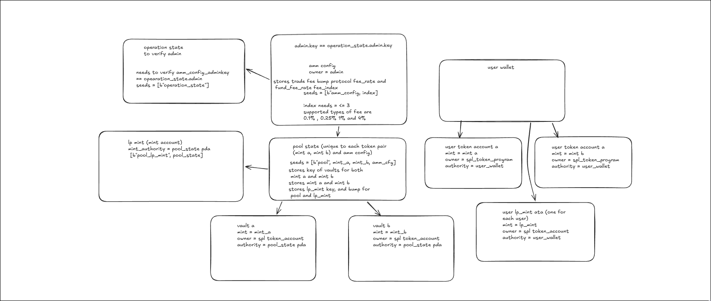

# 🌊 ApexFlow AMM

**ApexFlow** is a high-performance, non-custodial Automated Market Maker (AMM) built on the Solana blockchain using the Anchor framework. It implements a constant-product invariant ($x \cdot y = k$) with configurable fee tiers, protocol fee collection, and liquidity provider tokens.

**[View Deployment on Solana Explorer](https://explorer.solana.com/tx/5CVN7zWGcPiopVXtS6d31zKZGXHX4BrZdHeychjSUb7sG8JU4yavMEFQmqsU1awfSg5znK4GqkXiDFor1ds4mhh?cluster=devnet)**

---

## 🚀 Key Features

* **Permissionless Pool Creation**: Launch liquidity pools for any SPL token pair.
* **Flexible Fee Tiers**: Four distinct tiers (0.1%, 0.25%, 1%, and 4%) to cater to different asset volatilities.
* **LP Token Dynamics**: Automated minting/burning of LP tokens proportional to pool share.
* **Admin Controls**: Global "Circuit Breaker" to pause or unpause pools in emergencies.

---

## 🏗️ Architecture & Account Model

ApexFlow uses a Program Derived Address (PDA) architecture to ensure security and canonical state management. The diagram below illustrates the relationship between the global state, individual pools, and user wallets.



### Core Account Definitions

| Account | Seeds | Purpose |
| --- | --- | --- |
| **OperationState** | `["operation_state"]` | Singleton PDA storing the global admin key. |
| **AmmConfig** | `["amm_config", index]` | Stores fee rates for a specific tier. |
| **PoolState** | `["pool", mint_a, mint_b, config]` | Central state tracking vaults, mints, and fees. |
| **LpMint** | `["lp_mint", pool_state]` | Mint account for LP tokens, authorized by the pool. |

---

## 📊 Mathematical Logic

### Swap Invariant

Fees are deducted from the input amount before calculating the output to protect the liquidity providers:

$$trade\_fee = amount\_in \times \frac{trade\_fee\_rate}{10^9}$$

$$effective\_in = amount\_in - trade\_fee$$

$$amount\_out = \frac{reserve\_out \times effective\_in}{reserve\_in + effective\_in}$$

### Fee Distribution

The protocol collects a portion of every trade fee for ecosystem maintenance:

* **Protocol Cut**: 12% of the trade fee.
* **Fund Cut**: 4% of the trade fee.

---

## 🛠️ Developer Guide

### Prerequisites

* [Rust](https://rustup.rs/) & [Solana CLI](https://docs.solana.com/cli/install-solana-cli-tools)
* [Anchor Framework](https://www.anchor-lang.com/docs/installation)

### Build & Test

```bash
# Clone the repository
git clone https://github.com/s1mpleog/apex-flow

# Build the program
anchor build

# Run local tests with testing features enabled
anchor build -- --features local-testing && anchor test --skip-build

```

---

## 🛡️ Security Considerations

* **Mint Ordering**: Pools require `mint_a < mint_b` by public key to guarantee a single canonical pool per token pair.
* **Liquidity Lock**: 100 LP tokens are permanently locked on the first deposit to prevent price manipulation via "empty pool" attacks.
* **Integer Safety**: All math uses $u128$ intermediate values to prevent overflow before casting back to $u64$.
* **Context Validation**: Every instruction verifies the program ID and rejects unexpected accounts to prevent account substitution.

---

**Program ID:** `DshyYCvcP7cj1BUhH3VqwfYG8iPie5XzJPB8UGuUsdJD`

**IDL Account:** `HENRZtYPLHNpV23kJ8UBjLk1WbufnQLHZKsGHn2nVC98`

---
